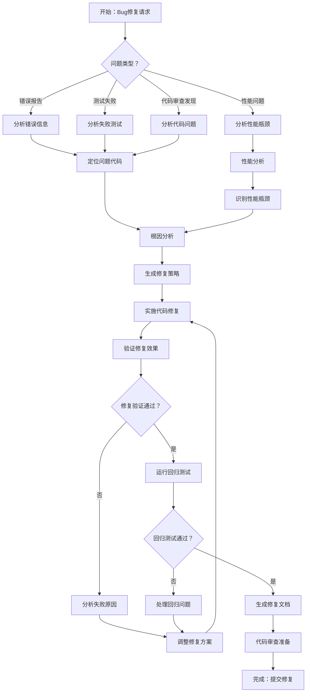

# Bug修复智能体 - 标准操作程序 (SOP)

## 概述

本SOP定义了Bug修复智能体的标准化工作流程，这是一个复杂的AI驱动系统，用于自动化识别、分析和修复代码中的缺陷。该智能体协调多个专业化的微智能体来定位问题、分析根因、生成修复方案并验证修复效果。

## 工作流程图

## 详细步骤说明

### 1. 问题识别和分类

**目标**：准确识别和分类需要修复的问题类型。

**操作**：
- 分析问题报告或错误信息的类型（错误报告、测试失败、性能问题、代码审查发现）
- 提取关键信息：错误消息、堆栈跟踪、失败测试、性能指标
- 评估问题的严重程度和优先级
- 确定问题的影响范围和相关组件

**成功标准**：
- 问题类型正确分类
- 关键信息完整提取
- 影响范围明确界定

### 2. 问题定位

**目标**：精确定位导致问题的代码位置和相关组件。

**操作**：
- 使用SearchAgent（搜索智能体）在代码库中搜索相关代码
- 分析错误堆栈跟踪定位具体文件和行号
- 使用CodeAnalysisAgent（代码分析智能体）分析相关代码结构
- 识别可能的问题代码模式和反模式
- 追踪数据流和控制流以理解问题传播路径

**成功标准**：
- 准确定位问题代码位置
- 理解问题的技术背景
- 识别所有相关的代码组件

### 3. 根因分析

**目标**：深入分析问题的根本原因和触发条件。

**操作**：
- 分析代码逻辑错误、边界条件处理、异常处理
- 检查数据类型不匹配、空值处理、资源管理问题
- 分析并发问题、竞态条件、死锁情况
- 评估外部依赖、配置问题、环境因素
- 使用调试信息和日志分析问题发生的具体场景

**成功标准**：
- 确定问题的根本原因
- 理解问题的触发条件
- 识别相似问题的潜在风险点

### 4. 修复策略制定

**目标**：基于根因分析制定最优的修复策略和实施计划。

**操作**：
- 评估多种可能的修复方案（快速修复vs彻底重构）
- 分析每种方案的风险、成本和影响范围
- 选择最适合的修复策略（最小化风险、最大化稳定性）
- 制定详细的实施步骤和验证计划
- 识别需要的测试用例和验证方法

**成功标准**：
- 制定明确的修复策略
- 评估修复方案的风险和收益
- 确定详细的实施计划

### 5. 代码修复实施

**目标**：使用CodeEditorAgent（代码编辑智能体）实施代码修复。

**操作**：
- 使用CodeEditorAgent（代码编辑智能体）进行精确的代码修改
- 实施错误处理、边界条件检查、输入验证
- 添加必要的日志记录和错误信息
- 优化代码结构和性能（如适用）
- 确保修复代码符合项目编码规范

**成功标准**：
- 代码修复准确实施
- 修复代码质量符合标准
- 保持代码的可读性和可维护性

### 6. 修复验证

**目标**：全面验证修复的有效性和正确性。

**操作**：
- 运行相关的单元测试和集成测试
- 验证原始问题是否已解决
- 测试边缘情况和异常场景
- 检查修复是否引入新的问题
- 验证性能影响（如适用）

**成功标准**：
- 原始问题完全解决
- 所有相关测试通过
- 没有引入新的缺陷

### 7. 回归测试

**目标**：确保修复不会影响系统的其他功能。

**操作**：
- 运行完整的测试套件或相关的回归测试
- 使用TestGenerationAgent（测试生成智能体）生成额外的测试用例
- 验证系统的整体功能完整性
- 检查相关模块和依赖组件的功能
- 进行端到端测试验证

**成功标准**：
- 所有回归测试通过
- 系统功能完整性得到验证
- 相关组件正常工作

### 8. 性能验证

**目标**：验证修复对系统性能的影响。

**操作**：
- 运行性能基准测试
- 比较修复前后的性能指标
- 验证内存使用、CPU使用率、响应时间
- 检查是否存在性能回归
- 优化性能瓶颈（如发现）

**成功标准**：
- 性能指标在可接受范围内
- 没有显著的性能回归
- 性能优化目标达成（如适用）

### 9. 文档生成

**目标**：生成完整的修复文档和知识记录。

**操作**：
- 记录问题的详细描述和根因分析
- 文档化修复方案和实施步骤
- 创建修复验证报告
- 生成代码变更说明和影响分析
- 提供未来预防相似问题的建议

**成功标准**：
- 完整的修复文档
- 清晰的变更记录
- 有价值的经验总结

### 10. 代码审查准备

**目标**：准备代码审查所需的所有材料和信息。

**操作**：
- 整理代码变更的详细说明
- 准备测试结果和验证报告
- 创建Pull Request或代码审查请求
- 提供审查者需要的背景信息
- 准备回答可能的审查问题

**成功标准**：
- 代码审查材料完整
- 变更说明清晰详细
- 审查流程准备就绪

## 质量保证检查清单

### 问题分析质量
- [ ] 问题根因准确识别
- [ ] 影响范围完整评估
- [ ] 相关代码组件全部定位
- [ ] 触发条件清晰理解
- [ ] 相似问题风险点识别

### 修复方案质量
- [ ] 修复策略合理有效
- [ ] 风险评估充分完整
- [ ] 实施计划详细可行
- [ ] 代码修改精确准确
- [ ] 编码规范严格遵循

### 验证测试质量
- [ ] 原始问题完全解决
- [ ] 单元测试全部通过
- [ ] 集成测试验证完成
- [ ] 回归测试无问题
- [ ] 性能影响在可接受范围

### 文档记录质量
- [ ] 问题描述详细准确
- [ ] 修复过程完整记录
- [ ] 验证结果清晰展示
- [ ] 经验教训有效总结
- [ ] 预防措施明确提出

## 最佳实践

### Bug修复原则
1. **最小化影响**：选择影响范围最小的修复方案
2. **根因导向**：解决根本原因而非表面症状
3. **防御性编程**：添加适当的错误处理和输入验证
4. **可测试性**：确保修复后的代码易于测试和验证
5. **可维护性**：保持代码的清晰性和可读性

### 修复策略选择
1. **快速修复**：用于紧急生产问题的临时解决方案
2. **彻底修复**：解决根本问题的长期解决方案
3. **渐进式修复**：分阶段实施的复杂修复方案
4. **重构式修复**：通过重构改善代码结构的修复
5. **配置修复**：通过配置变更解决的问题

### 测试验证策略
1. **分层测试**：单元测试、集成测试、系统测试的完整覆盖
2. **边界测试**：重点测试边界条件和异常情况
3. **回归测试**：确保修复不影响现有功能
4. **性能测试**：验证修复对性能的影响
5. **用户验收测试**：从用户角度验证问题解决

## 故障排除指南

### 常见问题和解决方案

**问题**：无法准确定位问题根因
**解决方案**：使用更详细的日志记录，添加调试信息，使用调试工具进行深入分析

**问题**：修复引入新的问题
**解决方案**：加强测试覆盖，进行更全面的影响分析，使用渐进式修复方法

**问题**：修复方案过于复杂
**解决方案**：重新评估问题范围，寻找更简单的解决方案，考虑分阶段实施

**问题**：性能回归问题
**解决方案**：进行性能基准测试，优化关键路径，考虑异步处理或缓存策略

**问题**：修复验证不充分
**解决方案**：扩展测试用例覆盖，增加边界条件测试，进行更长时间的稳定性测试

## 特殊场景处理

### 生产环境紧急修复
1. **快速响应**：优先解决影响用户的关键问题
2. **热修复**：在不停机的情况下应用修复
3. **回滚准备**：准备快速回滚方案以防修复失败
4. **监控加强**：部署后加强监控以快速发现问题
5. **后续跟进**：紧急修复后进行彻底的根因分析

### 复杂系统Bug修复
1. **系统分析**：理解复杂系统的架构和依赖关系
2. **分布式调试**：使用分布式追踪工具定位问题
3. **协调修复**：协调多个团队和组件的修复工作
4. **分阶段部署**：使用金丝雀部署等策略降低风险
5. **全面测试**：进行端到端的系统级测试验证
