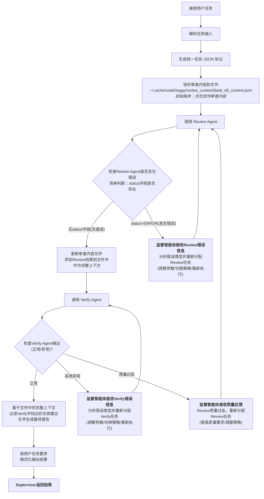

# Code Review 监督智能体 SOP

## 1. 概述
本协议适用于 **代码审查 Supervisor Agent** 与各子 Agent（如 CodeReview Agent、Verify Agent）之间的任务调度与数据传递，确保全链路参数一致性与结果可追踪性。

**核心目标**：
- **任务唯一性**：每个审查任务都有唯一标识，便于跟踪和管理
- **智能重试**：内置错误恢复机制，确保临时故障不会导致任务失败
- **完整溯源**：记录完整的执行链路，包括重试过程

**可靠性保障**：
通过监督智能体的智能重试机制，系统能够自动处理常见的临时性错误（如文件访问失败、格式错误等），确保任务始终能够完成。


## 2. 工作流程



## 3. 核心职责与协议

### 3.1 Supervisor 监督智能体职责
1. **任务初始化**：
   - 解析用户输入，确定工作目录
   - 创建标准化审查任务参数

2. **内容管理**：
   - 使用 `create_review_content_file` 保存待审查内容到全局缓存目录
   - 使用 `update_review_content_file_with_result` 保存各Agent结果

3. **Agent协调**：
   - 调用Review Agent执行代码审查
   - 调用Verify Agent验证Review结果的准确性和质量

4. **智能重试**：
   - 检测Agent错误，分析错误类型，自动修复
   - 最多重试3次，每次记录重试上下文
   - 特殊处理：质量过低错误（QUALITY_TOO_LOW）→ 重新调用Review Agent

5. **结果合并**：
   - 过滤Verify中找出的无效建议, 总结所有内容生成最后结果。
   - 根据用户要求格式化输出，直接返回结果


### 3.2 通用协议规范

#### 统一任务参数结构（所有Agent调用共用）
```json
{
  "task_id": "任务唯一标识",
  "review_type": "diff|file|snippet",
  "working_directory": "工作目录绝对路径",
  "task_desc": "任务描述，包含背景信息和特殊要求（可选）",
  "priority_focus": ["Security", "Performance"],
  "extra_requirements": ["具体要求列表"],
  "retry_context": {
    "attempt_number": 1,
    "previous_errors": [],
    "recovery_actions_taken": []
  }
}
```

#### 统一输出格式规范（所有Agent输出共用）
**成功输出格式：**
```json
{
  "task_id": "任务ID",
  "具体结果字段": "..."
}
```

**错误输出格式：**
```json
{
  "task_id": "任务ID",
  "status": "ERROR",
  "message": "详细错误原因"
}
```

**质量过低输出格式：**
```json
{
  "task_id": "任务ID",
  "status": "ERROR",
  "error_type": "QUALITY_TOO_LOW",
  "message": "Review Agent报告质量过低，建议重新审查",
  "quality_issues": ["具体质量问题描述"],
  "recommended_action": "重新分配review任务并加强质量要求"
}
```

#### 路径处理约定（整个调用链通用）
1. **操作目录获取**：
   - 优先从用户任务中解析操作目录路径（`working_directory`、`work_dir`、`repo_path`等）
   - 如果未指定，使用当前运行目录作为默认工作目录

2. **路径传递**：
   - 在调用子Agent时，必须在任务JSON中包含`working_directory`字段
   - 确保整个调用链中的路径一致性

### 3.3 子Agent职责
#### Review Agent
- **核心任务**：执行代码审查任务
- **输出格式**：返回审查报告JSON或错误JSON
- **审查内容**：基于review_type处理不同类型的审查（diff、file、snippet）

#### Verify Agent
- **核心任务**：验证Review Agent输出的准确性、规则合规性和整体质量
- **三个核心能力**：
  1. **错误建议识别**：识别技术错误、事实错误的建议
  2. **规则合规性检查**：检测违反执行约束规则的建议
  3. **质量评估与反馈**：评估审查质量（≥50分通过，<50分触发重新审查）

## 4. 审查内容文件格式

### 4.1 文件生命周期
审查内容文件在处理过程中逐步添加内容，形成完整的处理上下文。
**保存位置**：`~/.cache/codeDoggy/review_content/{task_id}_content.json`

### 4.2 文件结构演进

**初始版本（仅包含待审查内容）：**
```json
{
  "task_id": "task_codedoggy:gerrit:123:review_f1e2892152eb",
  "review_type": "diff",
  "created_at": "2024-06-18T15:30:22Z",
  "content": {
    "diff_content": "diff --git a/src/main.py b/src/main.py\n+def new_function():\n+    pass",
    "commit_metadata": {
      "source_commit": "abc1234",
      "target_commit": "abc1245"
    },
    "files_changed": ["/src/main.py", "/src/utils.py"],
    "review_scope": ["/src/auth/", "/src/payment/"],
    "target_file": "/src/app/main.py",
    "target_files": ["/src/a.py", "/src/b.py"],
    "snippet_code": "def hello(): pass",
  }
}
```

**Review Agent完成后（添加审查结果）：**
```json
{
  "task_id": "...",
  "review_type": "...",
  "created_at": "...",
  "content": { /* 原始待审查内容 */ },
  "review_result": {
    "task_id": "...",
    "issues": [/* Review Agent返回的完整issues数组 */],
    "summary": {/* Review Agent返回的summary */},
    "completed_at": "2024-06-18T15:35:22Z"
  }
}
```

## 5. Agent输出详细协议

### 5.1 Review Agent 输出协议

**正常结果：**
```json
{
  "task_id": "任务ID",
  "issues": [
    {
      "id": "ISSUE-001",
      "relevantFile": "问题文件相对路径 (必填)",
      "existingCode": "有问题的代码片段 (必填)",
      "suggestionContent": "问题分析：原因+影响+解决方案 (必填)",
      "improvedCode": "修复后的完整代码示例 (必填)",
      "label": "Quality|Security|Performance|Functionality (必填)",
      "suggestionLine": "问题行号(数字)(必填)",
      "severity": "Critical|High|Medium|Low"
    }
  ],
  "summary": {
    "total_issues": 0,
    "severity_distribution": {
      "Critical": 0, "High": 0, "Medium": 0, "Low": 0
    },
    "overall_assessment": "整体质量评语",
    "priority_recommendations": ["优先修复的关键问题列表"]
  }
}
```

### 5.2 Verify Agent 输出协议

**正常验证结果（质量≥50分）：**
```json
{
  "task_id": "任务ID",
  "verification_result": {
    "accuracy_check": [
      {
        "issue_id": "ISSUE-001",
        "accuracy_status": "CORRECT|INCORRECT|PARTIALLY_CORRECT",
        "evidence": "验证依据和具体原因",
        "deletion_required": false,
        "deletion_reason": "如果需要删除，说明删除原因"
      }
    ],
    "rule_compliance_check": [
      {
        "issue_id": "ISSUE-001",
        "compliance_status": "COMPLIANT|VIOLATED",
        "violated_rules": ["具体违反的规则描述"],
        "deletion_required": false,
        "violation_reason": "违反规则需要删除的原因"
      }
    ],
    "quality_assessment": {
      "overall_score": 85,
      "quality_level": "EXCELLENT|GOOD|ACCEPTABLE|POOR",
      "strengths": ["报告优点列表"],
      "weaknesses": ["需要改进的方面"],
      "missing_issues": [
        {
          "description": "遗漏的重要问题",
          "evidence": "问题位置和原因",
          "suggested_severity": "High"
        }
      ]
    }
  }
}
```

## 6. 错误处理与重试机制

### 6.1 错误处理原则
**核心原则**：遇到错误必须重试，不能直接结束任务
**重试限制**：最多重试3次
**上下文传递**：每次重试都在任务参数中添加retry_context

### 6.2 错误分类与处理策略

#### Agent执行错误
- **检测方式**：Agent返回`{status: "ERROR"}`
- **处理流程**：错误分析 → 自动修复 → 重试执行
- **重试策略**：根据错误类型调整参数后重新分配任务

#### 质量过低错误
- **检测方式**：Verify Agent返回`QUALITY_TOO_LOW`
- **处理流程**：提高质量要求 → 重新调用Review Agent
- **特殊性**：质量错误会重新从Review阶段开始

#### 系统级错误
- **检测方式**：工具调用失败、文件访问异常等
- **处理流程**：Supervisor自动修复（如重建文件）→ 重新执行
- **自愈能力**：本地自愈，避免不必要的Agent重试

### 6.3 重试上下文示例
```json
{
  "task_id": "...",
  "review_type": "...",
  "working_directory": "...",
  "task_desc": "原始任务描述。重试信息：上次失败原因为审查内容缺失，已重新创建审查内容文件。",
  "retry_context": {
    "attempt_number": 2,
    "previous_errors": ["审查内容缺失"],
    "recovery_actions_taken": ["recreate_content_file"]
  }
}
```

## 7. 输出格式转换

### 7.1 支持的输出格式

**详细报告格式（默认）：**
```json
{
  "task_id": "...",
  "summary": "...",
  "review_results": { /* 审查结果 */ },
  "verification_results": { /* 验证结果 */ },
  "final_recommendations": [ /* 最终建议 */ ]
}
```

**简单数组格式：**
```json
[
  {
    "relevantFile": "文件路径",
    "existingCode": "问题代码",
    "suggestionContent": "问题分析和解决方案",
    "improvedCode": "改进代码",
    "label": "问题类型",
    "suggestionLine": "行号"
  }
]
```

### 7.2 格式转换原则
**核心原则：优先按照用户要求的格式返回结果**

1. **用户格式优先**：
   - 如果用户在任务中明确要求特定格式，必须严格按照用户要求转换
   - 当用户格式要求与系统默认格式冲突时，以用户要求为准
2. **其他原则**：
   - **数据完整性**：转换过程不丢失关键信息
   - **用户友好**：输出格式符合用户的使用习惯和工具链要求
   - **可扩展性**：支持添加新的输出格式而不影响现有流程
   - **直接传递**：格式化后的结果直接由Supervisor返回，不经过文件系统
