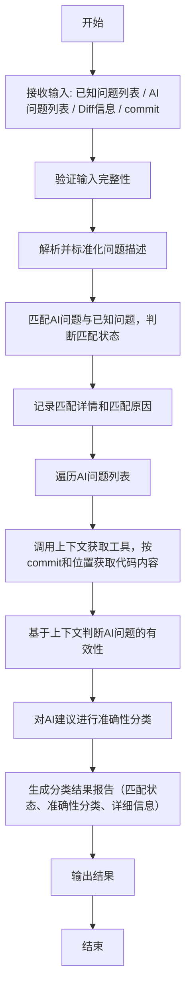

# **AI CodeReview 评测分析智能体**


## **1. 目的**
本SOP用于说明AI CodeReview评测分析智能体的功能、输入输出要求、执行流程及依赖条件。
智能体的目标是对AI CodeReview工具生成的问题列表进行验证与分析，通过与已知问题列表进行比对，判断**匹配状态**与**准确性**，并确保分析过程基于真实且一致的代码上下文。

## **2. 分析任务定义**

- **已知问题匹配判断**
  - **任务**： 判断AI生成的建议是否匹配到已知问题列表中的问题
  - **说明**： 基于文件路径、行号、问题描述的综合相似度进行匹配判断。

- **建议准确性判断**
  - **任务**： 判断AI建议在当前代码上下文中是否准确有效
  - **说明**： 结合diff上下文和代码逻辑，判断建议的有效性。


## **3. 功能说明**

智能体主要具备以下功能：

1. **输入接收与格式验证**
   - 接收：已知问题列表（Ground Truth）
   - 接收：AI生成的问题列表
   - 接收：Diff变更信息（包含文件路径及变更行号范围）
   - 接收：任务元信息（commit hash / PR编号 / branch）

2. **数据解析与匹配判断**
   - 标准化与去噪处理（问题描述格式化、统一编码等）
   - 匹配AI结果与已知问题，判断匹配状态并记录匹配详情

3. **上下文获取与准确性判断**
   - 调用外部**上下文获取工具接口**，按需获取指定代码版本的上下文片段
   - 基于上下文判断AI产出问题的真实性与合理性
   - 重复出现或相似性较高的意见只保留一条为有效数据
   - 对每个AI建议进行准确性分类

4. **结果分类与输出**
   - 输出匹配到的已知问题详细列表
   - 输出有效和无效的AI建议分类结果
   - 可选生成分析报告（JSON）


## **4. 流程说明**




## **5. 输出要求**

- 核心字段（固定必有）

  - 在任何任务、任何版本中都必须输出，类型与命名保持一致。

- 扩展字段（可选动态）

  - 根据任务或分析需求动态增加，不与核心字段重名，命名自由。

  #### **核心字段定义**

  | 字段名                          | 类型          | 说明                               |
  | ------------------------------- | ------------- | ---------------------------------- |
  | `recognized_known_issues_count` | int           | 正确识别的已知问题个数             |
  | `known_issues_total`            | int           | 已知问题总数                       |
  | `valid_ai_issues_count`         | int           | 有效建议个数（上下文确认有效）     |
  | `ai_generated_issues_total`     | int           | AI 生成建议总数                    |
  | `matched_known_issues`          | array<object> | 命中已知问题列表                   |
  | `invalid_ai_issues`             | array<object> | 错误/无效建议列表                  |

  **子结构格式**（`matched_known_issues[]` 和 `invalid_ai_issues[]`）：

  ```
  {
    "file_path": "string",
    "line": 0,
    "description": "string"
    "reason" : "string" // 需要说明无效的原因
  }
  ```

  #### **扩展字段规则**

  - 允许存在任意额外字段（string、number、object、array 类型均可）
  - 不能与核心字段同名
  - 命名建议明确业务含义，例如：
    - `score_distribution`
    - `meta_agent_version`
    - `custom_debug_log`

  #### **输出结构体示例**

  ```json
  {
    "recognized_known_issues_count": 8,
    "known_issues_total": 10,
    "valid_ai_issues_count": 9,
    "ai_generated_issues_total": 12,
    "matched_known_issues": [
      {
        "file_path": "config_plug_in/generator/context/functions.py",
        "line": 140,
        "description": "变量 core_number 可能未赋值"
        "reason" : "存在能匹配成功的建议"
      }
    ],
    "invalid_ai_issues": [
      {
        "file_path": "services/copilot/server/routes.go",
        "line": 56,
        "description": "缺少 user == nil 检查"
        "reason": "这里不需要nil检查"
      }
    ],
    "score_distribution": {
      "high": 5,
      "medium": 4,
      "low": 3
    },
    "meta_agent_version": "1.1.0",
    "custom_debug_log": "分析过程中跳过了两个文件"
  }
  ```


## **6. 限制条件**

- 上下文获取依赖外部工具的正确性和可用性
- 准确性判断高度依赖上下文完整度
- 相似度匹配阈值会影响匹配结果，需在执行前固定配置
- 本SOP仅分析已知问题的匹配状态与建议准确性，不涉及新问题的发现能力


## **7. 执行标准**
1. 相同输入条件下，多次执行结果应完全一致（可复现）
2. 对于每个AI建议，都需要明确给出匹配状态和准确性判断
3. 匹配判断需要基于文件路径、行号、问题描述的综合相似度
4. 准确性判断需要结合diff上下文和代码逻辑进行分析
