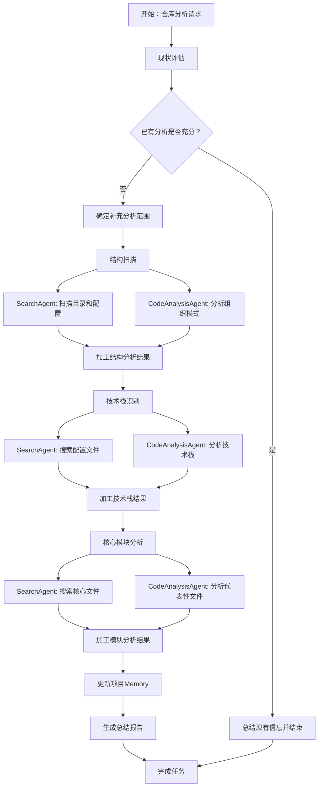

# 代码仓库分析 SOP

## 核心原则

### 监督智能体职责
- 协调微智能体团队完成分析任务
- 对微智能体结果进行加工和整合
- 将处理后的结果更新到Memory

### 增量分析策略
- 先检查已有分析，避免重复工作
- 只补充缺失或过时的部分
- 如果已有分析充分，可直接结束

### 大型仓库处理
- 使用搜索而非遍历文件
- 重点文件优先，智能采样
- 限制分析数量（如"不超过5个文件"）

### 结果加工要求
- 不要直接转存微智能体的原始结果
- 补充上下文信息，使用Markdown格式
- 将多个结果综合成连贯的分析
- **所有分析结果必须使用中文**

## SOP工作流程



## 详细步骤

### 1. 现状评估
- 获取已有分析：`memory_get_project_context()`
- 评估完整性，识别缺失部分
- 决定是否需要补充分析

### 2. 结构扫描（按需）
- 委派SearchAgent：扫描目录结构，识别配置文件
- 委派CodeAnalysisAgent：分析项目组织模式
- 加工结果并更新Memory

### 3. 技术栈识别（按需）
- 委派SearchAgent：搜索配置文件
- 委派CodeAnalysisAgent：分析技术栈信息
- 整合结果并更新Memory

### 4. 核心模块分析（按需）
- 委派SearchAgent：搜索核心文件
- 委派CodeAnalysisAgent：分析代表性文件
- 综合分析并更新Memory

### 5. 总结报告
- 整合所有分析结果
- 生成项目概览
- 完成任务

## Memory更新规范

### 项目级信息
```
project.summary                    # 项目总体概述
project.structure.overview         # 目录结构概览
project.stack.languages           # 编程语言和版本
project.stack.frameworks          # 主要框架和库
project.architecture.patterns     # 架构模式和设计
project.codebase.modules          # 核心模块和组件
```

### 任务级信息
```
task.progress.current_phase        # 当前分析阶段
task.discoveries.key_findings     # 重要发现
task.results.analysis_summary     # 分析结果总结
```

## 最佳实践

### 任务委派
- 给微智能体具体、明确的任务指令
- 限制分析范围和数量
- 等待结果后进行加工处理

### 结果处理
- 补充完整的上下文信息
- 使用清晰的Markdown结构
- 避免直接转存原始输出
- 确保所有输出内容使用中文

### 效率优化
- 优先使用搜索工具
- 采用智能采样策略
- 避免重复分析已有信息

## 禁止行为
- ❌ 不要自己直接执行技术分析
- ❌ 不要逐个文件遍历大型仓库
- ❌ 不要直接转存微智能体原始结果
- ❌ 不要重复分析已有的准确信息
