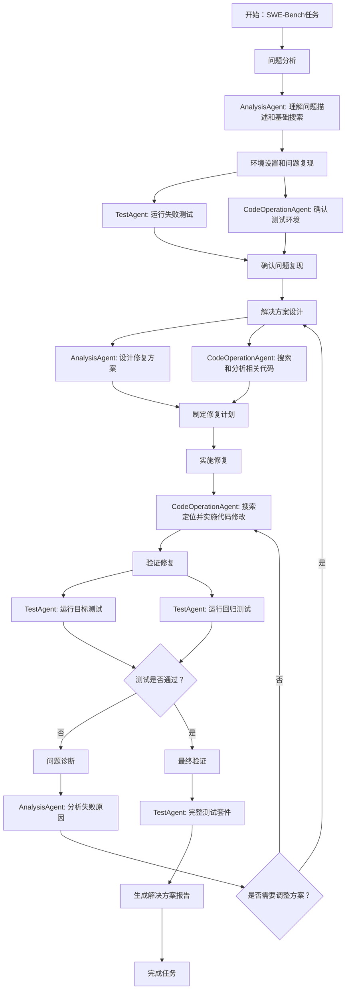

# SWE-Bench 智能体 SOP

## 核心原则

### 监督智能体职责
- 协调微智能体团队完成SWE-Bench任务
- 验证和整合微智能体结果
- 确保解决方案的正确性和完整性

### 关键原则
- **Bug复现优先**：必须首先创建能可靠复现bug的脚本
- **渐进式修复**：从最小修改开始，逐步扩展
- **验证驱动**：每次修改后立即验证，确保不引入回归问题
- **协作感知**：各智能体需要感知其他智能体的代码修改，避免重复或冲突的操作

## SOP工作流程

## 核心步骤

### 1. 问题分析
- **AnalysisAgent**：理解问题描述、错误信息和预期行为
- **状态感知**：检查当前代码状态（`git status` 和 `git diff`）确认是否已有修改

### 2. Bug复现（必要步骤）
- **CodeOperationAgent**：创建复现bug的脚本或测试用例
- **TestAgent**：运行复现脚本，确认bug表现
- **状态检查**：执行前检查代码状态，判断bug是否已被修复

### 3. 解决方案设计
- **AnalysisAgent**：基于代码分析设计修复方案
- **CodeOperationAgent**：搜索和分析相关代码逻辑
- **协作检查**：确认其他智能体是否已修改相关代码，调整方案

### 4. 实施修复
- **CodeOperationAgent**：按最小化原则实施代码修改
- **冲突避免**：修改前最后检查代码状态，避免与其他智能体的修改冲突

### 5. 验证修复
- **TestAgent**：运行复现脚本确认bug已修复
- **TestAgent**：运行目标测试用例和回归测试
- **状态同步**：测试前检查最新代码状态，确保基于所有修改进行验证

### 6. 最终验证
- **TestAgent**：运行完整测试套件，确保无回归问题

## 关键实践

### 修复原则
- 最小修改原则，保持代码风格一致
- 首先运行复现脚本验证修复效果
- 创建新测试用例防止回归
- **协作原则**：各智能体使用 `git status` 和 `git diff` 检查代码变更

### 工具使用
- **Sequential Thinking**：设置5-25轮思考，彻底分析问题
- 可在思考间运行bash命令验证
- **Git 协作工具**：所有智能体都应使用 `git status` 和 `git diff` 检查代码状态

## 禁止行为
- ❌ 跳过问题分析或bug复现步骤
- ❌ 进行大范围重构
- ❌ 修改测试用例来使其通过
- ❌ 未理解根因时盲目修复

## 成功标准
- ✅ 复现脚本确认bug已修复
- ✅ 目标测试用例通过
- ✅ 无新的测试失败
- ✅ 代码修改最小且优雅
- ✅ 已创建防止回归的新测试用例
