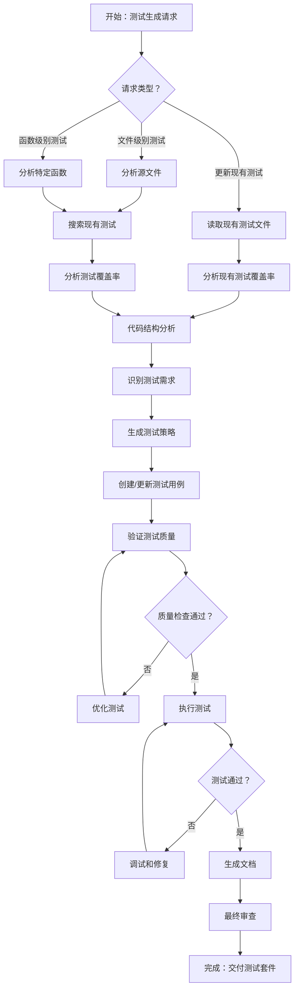

# 测试生成智能体 - 标准操作程序 (SOP)

## 概述

本SOP定义了测试生成智能体的标准化工作流程，这是一个复杂的AI驱动系统，为现有代码库生成全面的测试套件。该智能体协调多个专业化的微智能体来分析代码、生成测试并确保全面覆盖。

## 工作流程图

## 详细步骤说明

### 1. 初始请求处理

**目标**：解析并分类传入的测试生成请求。

**操作**：
- 识别测试生成请求的类型（文件级别测试、函数级别测试或更新现有测试）
- 提取关键参数：源文件路径、目标函数、测试框架偏好、输出位置
- 验证输入参数和文件可访问性
- 为任务设置适当的上下文和范围

**成功标准**：
- 正确识别请求类型
- 提取并验证所有必需参数
- 明确定义范围和上下文

### 2. 源代码分析

**目标**：彻底分析源代码以了解结构、复杂性和测试需求。

**操作**：
- 使用CodeAnalysisAgent（代码分析智能体）解析源文件
- 提取所有函数、类、方法及其签名
- 识别依赖项、导入和外部集成
- 分析代码复杂性和潜在边缘情况
- 记录数据流和业务逻辑模式

**成功标准**：
- 完整的可测试组件清单
- 理解代码依赖关系和复杂性
- 识别潜在的测试挑战

### 3. 现有测试发现

**目标**：定位并分析现有测试文件以了解当前覆盖率并避免重复。

**操作**：
- 使用SearchAgent（搜索智能体）在仓库中查找相关测试文件
- 使用命名约定搜索测试文件（test_*、*_test.py等）
- 分析现有测试结构和模式
- 识别已在使用的测试框架
- 将现有测试映射到源代码组件

**成功标准**：
- 现有测试的完整清单
- 理解当前测试覆盖率
- 识别测试模式和约定

### 4. 测试需求识别

**目标**：基于代码分析和现有覆盖率差距定义全面的测试需求。

**操作**：
- 将源代码组件与现有测试覆盖率进行比较
- 识别未测试的函数、方法和边缘情况
- 分类测试需求（单元测试、集成测试、错误处理）
- 根据代码复杂性和重要性优先排序测试用例
- 定义测试数据需求和模拟策略

**成功标准**：
- 需要测试的组件清单明确
- 优先级测试路线图
- 定义的测试类别和方法

### 5. 测试策略制定

**目标**：创建针对特定代码库和需求的全面测试策略。

**操作**：
- 选择适当的测试框架（pytest、unittest等）
- 设计测试文件结构和组织
- 规划依赖项的fixture和模拟策略
- 定义测试数据生成方法
- 建立命名约定和文档标准

**成功标准**：
- 明确定义的测试策略文档
- 清晰的框架和工具决策
- 结构化的测试组织方法

### 6. 测试用例生成

**目标**：使用UnitTestAgent（测试生成智能体）生成全面、高质量的测试用例。

**操作**：
- 使用UnitTestAgent（测试生成智能体）为每个识别的组件创建测试用例
- 为正常路径场景生成测试
- 创建边缘情况和边界条件测试
- 实现错误处理和异常测试
- 为组件交互添加集成测试
- 在适用的情况下包含性能测试

**成功标准**：
- 所有识别组件的完整测试覆盖
- 测试涵盖正常、边缘和错误场景
- 测试遵循既定的模式和约定

### 7. 测试质量验证

**目标**：确保生成的测试符合质量标准和最佳实践。

**操作**：
- 审查测试代码的清晰性和可维护性
- 验证测试隔离和独立性
- 检查fixture和模拟的适当使用
- 验证测试断言是有意义和具体的
- 确保测试遵循命名约定
- 审查测试文档和注释

**成功标准**：
- 测试通过质量审查清单
- 测试是可维护和可读的
- 测试遵循既定的最佳实践

### 8. 测试执行和验证

**目标**：执行生成的测试以确保它们正常工作并提供有意义的反馈。

**操作**：
- 使用适当的测试运行器运行生成的测试
- 验证所有测试成功通过
- 检查测试输出的有意义断言
- 验证测试覆盖率指标
- 识别并解决任何测试失败或问题

**成功标准**：
- 所有生成的测试成功执行
- 测试提供有意义的覆盖率指标
- 测试结果中没有误报或漏报

### 9. 测试调试和优化

**目标**：解决执行过程中发现的任何测试失败或质量问题。

**操作**：
- 分析测试失败的根本原因
- 使用FileUpdateAgent（文件更新智能体）修复测试问题
- 优化测试断言和期望
- 改进测试数据和模拟配置
- 优化测试性能和可靠性

**成功标准**：
- 所有测试失败都得到解决
- 测试在可靠性和性能方面得到优化
- 测试质量符合既定标准

### 10. 文档生成

**目标**：为生成的测试套件创建全面的文档。

**操作**：
- 生成测试套件概述文档
- 记录测试执行程序
- 创建测试维护指南
- 记录模拟和fixture的使用
- 提供常见问题的故障排除指南

**成功标准**：
- 完整的文档包
- 清晰的测试维护说明
- 全面的故障排除资源

### 11. 最终审查和交付

**目标**：进行最终质量保证并交付完整的测试套件。

**操作**：
- 对所有生成的工件进行全面审查
- 根据原始需求验证测试套件的完整性
- 确保所有文档准确完整
- 打包测试套件以供交付
- 提供实施建议

**成功标准**：
- 测试套件满足所有原始需求
- 文档完整准确
- 交付包准备就绪可供实施

## 质量保证检查清单

### 测试代码质量
- [ ] 测试结构良好且可读
- [ ] 适当使用fixture和模拟
- [ ] 有意义的测试名称和描述
- [ ] 正确的错误处理和断言
- [ ] 测试是隔离和独立的

### 覆盖率要求
- [ ] 所有公共函数和方法都经过测试
- [ ] 边缘情况和边界条件得到覆盖
- [ ] 错误处理场景得到测试
- [ ] 集成点得到验证
- [ ] 性能考虑得到解决

### 文档标准
- [ ] 测试目的和范围得到记录
- [ ] 设置和执行说明清晰
- [ ] 模拟和fixture使用得到解释
- [ ] 维护程序得到记录
- [ ] 提供故障排除指南

## 最佳实践

### 测试设计原则
1. **安排-执行-断言 (AAA)**：用清晰的设置、执行和验证阶段构建测试
2. **单一职责**：每个测试应验证一个特定行为
3. **描述性命名**：测试名称应清楚描述正在测试的内容
4. **测试独立性**：测试不应依赖彼此的执行或状态
5. **有意义的断言**：使用提供清晰失败消息的特定断言

### 模拟和Fixture策略
1. **模拟外部依赖**：将被测单元与外部系统隔离
2. **使用Fixture进行通用设置**：通过可重用的fixture减少代码重复
3. **在正确级别进行模拟**：在边界处模拟以保持测试价值
4. **验证模拟交互**：确保模拟按预期被调用
5. **保持模拟简单**：避免过于复杂的模拟配置

### 错误处理和边缘情况
1. **测试错误条件**：验证错误场景的正确处理
2. **边界值测试**：测试输入范围的限制和边缘情况
3. **空值和空输入测试**：验证对空值、空和无效输入的处理
4. **异常测试**：确保正确的异常类型和消息
5. **资源清理**：验证错误场景中的正确清理

## 故障排除指南

### 常见问题和解决方案

**问题**：由于缺少依赖项导致测试失败
**解决方案**：正确审查和模拟外部依赖项

**问题**：测试不稳定或不一致
**解决方案**：确保测试隔离并移除共享状态依赖

**问题**：报告的测试覆盖率低
**解决方案**：审查代码分析并为遗漏的组件添加测试

**问题**：测试执行缓慢
**解决方案**：优化测试数据，使用适当的模拟，并在可能的情况下并行化

**问题**：生成的测试不匹配现有模式
**解决方案**：更彻底地分析现有测试文件并适应既定约定
