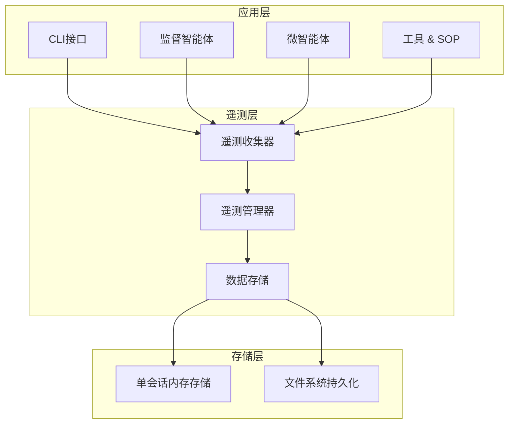

# SOP Agents 遥测系统

## 概述

SOP Agents 遥测系统为三层架构（CLI接口 → 监督智能体 → 微智能体 + 工具 + SOP）提供全面的监控和统计收集功能。该系统设计为零配置、非侵入式且高度可靠，能够收集详细的性能、成本和使用指标。

遥测系统作为透明层运行，自动对所有智能体交互进行插桩，无需对现有实现进行代码更改。它遵循"故障安全"设计理念，遥测故障永远不会影响核心系统功能。

**注意**: 该系统专为单会话智能体执行设计，适用于启动-执行-退出的工作流程。

## 核心特性

- **零配置操作**: 开箱即用，无需任何设置
- **自动插桩**: 透明地集成到所有智能体中
- **全面数据收集**: 令牌使用、执行时间、任务信息、环境上下文
- **简单存储**: 单会话内存存储 + 文件持久化
- **故障安全**: 遥测错误不影响主系统功能
- **性能优化**: 执行开销 < 5%
- **单会话设计**: 专为一次性任务执行优化

## 架构设计

### 高层架构



### 组件交互流程

1. **插桩层**: 自动包装智能体方法和LLM调用
2. **收集层**: 实时收集指标，开销最小
3. **聚合层**: 在单会话内处理和关联数据
4. **存储层**: 内存存储 + 会话结束时文件持久化

## 核心组件

### 1. 遥测管理器 (TelemetryManager)

**作用**: 协调单会话智能体执行中的遥测收集。

**主要职责**:
- 零配置初始化遥测系统
- 管理单个会话的数据收集
- 处理会话生命周期和数据关联
- 处理优雅关闭和数据持久化

**使用方式**:
```python
from ai_agents.telemetry import TelemetryManager

# 获取单例实例
manager = TelemetryManager.get_instance()

# 初始化（自动完成）
manager.initialize()

# 获取收集器（单会话）
collector = manager.get_collector()

# 手动刷新数据
manager.flush_data()

# 获取当前会话数据
session_data = manager.get_session_data()

# 获取存储统计
stats = manager.get_storage_stats()
```

### 2. 遥测收集器 (TelemetryCollector)

**作用**: 从智能体和工具收集遥测数据的主要接口。

**主要职责**:
- 透明地插桩智能体方法调用
- 跟踪LLM令牌使用和模型信息
- 高精度测量执行时间
- 收集任务元数据和环境上下文

**核心方法**:
```python
from ai_agents.telemetry import TelemetryCollector

collector = TelemetryCollector()

# 任务管理
collector.start_task("task_123", "分析代码仓库")
collector.end_task("task_123", TaskStatus.COMPLETED)

# LLM调用记录
collector.record_llm_call(
    model="gpt-4",
    prompt_tokens=100,
    completion_tokens=50,
    duration=2.5
)

# 智能体执行记录
collector.record_agent_execution(
    agent_type="supervisor",
    agent_name="RepoAnalysisAgent",
    duration=30.2
)

# 工具使用记录
collector.record_tool_usage(
    tool_name="file_reader",
    duration=0.5
)
```

### 3. 数据存储 (TelemetryDataStore)

**作用**: 处理单会话数据的内存存储和文件持久化。

**主要职责**:
- 在内存中存储当前会话数据
- 会话结束时将数据写入文件
- 安全处理并发访问
- 自动清理旧文件

**存储位置**: `~/.cache/ept/sop_agents/`

**文件格式**: JSON格式，每个会话一个文件，基于会话ID命名

### 4. 智能体插桩 (AgentInstrumentor)

**作用**: 自动插桩基于smolagents的SOPAgents类，无需代码修改。

**插桩目标**:
- `MultiStepAgent.run()`: 智能体执行的主入口点
- `Model.generate()` 和 `Model.generate_stream()`: LLM调用的令牌跟踪
- 工具执行方法: 工具调用时间和结果
- 托管智能体调用: 智能体间通信跟踪

## 数据模型

### 会话数据结构

```python
@dataclass
class TelemetrySession:
    session_id: str                    # 会话唯一标识
    start_time: datetime              # 会话开始时间
    end_time: Optional[datetime]      # 会话结束时间
    environment: EnvironmentInfo      # 环境信息
    tasks: List[TaskExecution]        # 任务执行列表
    total_tokens: TokenUsage          # 总令牌使用量
    total_duration: float             # 总执行时间
```

### 任务执行数据

```python
@dataclass
class TaskExecution:
    task_id: str                      # 任务唯一标识
    description: str                  # 任务描述
    start_time: datetime             # 任务开始时间
    end_time: Optional[datetime]     # 任务结束时间
    status: TaskStatus               # 任务状态
    sop_category: Optional[str]      # SOP类别
    agents: List[AgentExecution]     # 智能体执行列表
    tools: List[ToolExecution]       # 工具执行列表
    llm_calls: List[LLMCall]         # LLM调用列表
    code_changes: CodeMetrics        # 代码变更指标
```

### 令牌使用跟踪

```python
@dataclass
class TokenUsage:
    prompt_tokens: int                           # 提示令牌数
    completion_tokens: int                       # 完成令牌数
    total_tokens: int                           # 总令牌数
    model_breakdown: Dict[str, TokenUsage]      # 按模型分解
    cost_estimate: Optional[float]              # 成本估算
```

### 环境上下文

```python
@dataclass
class EnvironmentInfo:
    os_type: str                     # 操作系统类型
    os_version: str                  # 操作系统版本
    python_version: str              # Python版本
    working_directory: str           # 工作目录
    project_root: str               # 项目根目录
    user_name: Optional[str]        # 用户名
    timezone: str                   # 时区
    environment_variables: Dict[str, str]  # 环境变量
```

## 自动集成

### 监督智能体集成

遥测系统自动集成到 `BaseSupervisorAgent` 中：

```python
from ai_agents.supervisor_agents.base_supervisor_agent import BaseSupervisorAgent

class MyCustomSupervisorAgent(BaseSupervisorAgent):
    # 遥测自动启用，无需额外代码
    pass

# 使用时自动收集遥测数据
agent = MyCustomSupervisorAgent()
result = agent.run("执行任务")  # 自动记录执行时间、LLM调用等
```

### 微智能体集成

遥测系统自动集成到 `BaseMicroAgent` 中：

```python
from ai_agents.micro_agents.base_micro_agent import BaseMicroAgent

class MyCustomMicroAgent(BaseMicroAgent):
    # 遥测自动启用，无需额外代码
    pass

# 通过get_code_agent()获取的智能体自动包含遥测
agent = MyCustomMicroAgent()
code_agent = agent.get_code_agent()  # 自动插桩
```

### YAML配置的智能体

通过YAML配置创建的智能体也会自动继承遥测功能：

```yaml
# agents.yaml
agents:
  - name: "search_agent"
    type: "micro"
    tools: ["file_search", "text_grep"]
```

```python
# 自动包含遥测功能
agent = create_agent_from_yaml("search_agent")
```

## 使用示例

### 基本使用

```python
from ai_agents.telemetry import TelemetryManager
from ai_agents.supervisor_agents.repo_analysis_supervisor_agent import RepoAnalysisSupervisorAgent

# 遥测自动初始化
agent = RepoAnalysisSupervisorAgent()

# 执行任务，自动收集遥测数据
result = agent.run("分析这个代码仓库的架构")

# 获取遥测数据
manager = TelemetryManager.get_instance()
session_data = manager.get_session_data()

print(f"总令牌使用: {session_data.total_tokens.total_tokens}")
print(f"执行时间: {session_data.total_duration}秒")
print(f"任务数量: {len(session_data.tasks)}")
```

### 手动数据收集

```python
from ai_agents.telemetry import TelemetryManager, TaskStatus

manager = TelemetryManager.get_instance()
collector = manager.get_collector()

# 开始任务
collector.start_task("custom_task", "自定义任务")

# 记录LLM调用
collector.record_llm_call(
    model="gpt-4",
    prompt_tokens=150,
    completion_tokens=75,
    duration=3.2
)

# 记录工具使用
collector.record_tool_usage("file_reader", 0.8)

# 结束任务
collector.end_task("custom_task", TaskStatus.COMPLETED)
```

### 获取统计信息

```python
from ai_agents.telemetry import TelemetryManager

manager = TelemetryManager.get_instance()

# 获取存储统计
stats = manager.get_storage_stats()
print(f"存储路径: {stats['storage_path']}")
print(f"活跃收集器: {stats['active_collectors']}")
print(f"总文件数: {stats['total_files']}")

# 获取所有会话ID
session_ids = manager.get_all_session_ids()
print(f"历史会话: {len(session_ids)}")

# 获取特定会话数据
for session_id in session_ids[-5:]:  # 最近5个会话
    session = manager.get_session_data(session_id)
    if session:
        print(f"会话 {session_id}: {len(session.tasks)} 个任务")
```

## 配置选项

虽然遥测系统设计为零配置，但也提供了一些配置选项：

```python
from ai_agents.telemetry import TelemetryManager

# 自定义配置
config = {
    "enabled": True,                    # 启用/禁用遥测
    "storage_dir": "/custom/path",      # 自定义存储目录
    "max_file_age_days": 14,           # 文件最大保存天数
    "auto_cleanup": True,               # 自动清理旧文件
}

manager = TelemetryManager.get_instance()
manager.initialize(config)
```

### 禁用遥测

```python
from ai_agents.telemetry import TelemetryManager

manager = TelemetryManager.get_instance()

# 禁用遥测
manager.disable_telemetry()

# 重新启用
manager.enable_telemetry()
```

## 数据分析

### 令牌使用分析

```python
def analyze_token_usage(session: TelemetrySession):
    """分析会话的令牌使用情况"""
    total_tokens = session.total_tokens

    print(f"总令牌使用: {total_tokens.total_tokens}")
    print(f"提示令牌: {total_tokens.prompt_tokens}")
    print(f"完成令牌: {total_tokens.completion_tokens}")

    # 按模型分解
    for model, usage in total_tokens.model_breakdown.items():
        print(f"{model}: {usage.total_tokens} 令牌")

    # 成本估算
    if total_tokens.cost_estimate:
        print(f"估算成本: ${total_tokens.cost_estimate:.4f}")
```

### 性能分析

```python
def analyze_performance(session: TelemetrySession):
    """分析会话的性能情况"""
    print(f"总执行时间: {session.total_duration:.2f}秒")

    # 按任务分析
    for task in session.tasks:
        print(f"任务 {task.task_id}: {task.duration:.2f}秒")

        # 按智能体分析
        for agent in task.agents:
            print(f"  {agent.agent_name}: {agent.duration:.2f}秒")

        # 按工具分析
        for tool in task.tools:
            print(f"  工具 {tool.tool_name}: {tool.duration:.2f}秒")
```

### 导出数据

```python
def export_session_data(session_id: str, output_file: str):
    """导出会话数据到文件"""
    manager = TelemetryManager.get_instance()
    session = manager.get_session_data(session_id)

    if session:
        # 导出为JSON
        with open(output_file, 'w', encoding='utf-8') as f:
            f.write(session.to_json())

        print(f"会话数据已导出到: {output_file}")
    else:
        print(f"未找到会话: {session_id}")
```

## 错误处理

遥测系统采用故障安全设计，确保遥测错误不会影响主系统功能：

### 自动错误恢复

```python
from ai_agents.telemetry.error_handler import safe_telemetry_operation

@safe_telemetry_operation("custom_operation")
def my_telemetry_function():
    """使用装饰器确保错误安全"""
    # 遥测操作代码
    pass
```

### 错误监控

```python
from ai_agents.telemetry import get_error_handler

error_handler = get_error_handler()

# 获取错误摘要
error_summary = error_handler.get_error_summary()
print(f"遥测错误数量: {len(error_summary)}")

# 重置错误状态
error_handler.reset_error_state()
```

## 性能优化

### 内存管理

- 自动清理旧会话数据
- 内存使用限制和监控
- 批量操作减少I/O开销

### 并发处理

- 线程安全的数据收集
- 异步文件操作
- 无锁数据结构

### 资源约束处理

```python
# 系统会自动检测资源约束并优雅降级
# 例如：磁盘空间不足时停止写入，但继续内存收集
```

## 最佳实践

1. **保持默认配置**: 零配置设计已经优化了大多数使用场景
2. **定期清理**: 使用自动清理功能管理存储空间
3. **监控性能**: 定期检查遥测开销是否在可接受范围内
4. **错误监控**: 定期检查遥测错误日志
5. **数据分析**: 利用收集的数据优化智能体性能

## 故障排除

### 常见问题

**Q: 遥测数据没有被收集**
A: 检查遥测是否被禁用：
```python
manager = TelemetryManager.get_instance()
print(f"遥测状态: {manager.is_enabled()}")
```

**Q: 存储空间不足**
A: 手动清理旧数据：
```python
manager = TelemetryManager.get_instance()
cleaned = manager.cleanup_old_data(max_age_days=7)
print(f"清理了 {cleaned} 个文件")
```

**Q: 性能影响过大**
A: 调整配置减少开销：
```python
config = {
    "flush_interval": 600,  # 增加刷新间隔
    "max_memory_sessions": 20,  # 减少内存会话数
}
manager.initialize(config)
```

### 调试模式

```python
import logging

# 启用遥测调试日志
logging.getLogger('ai_agents.telemetry').setLevel(logging.DEBUG)
```

## API参考

完整的API文档请参考各组件的源代码注释：

- `ai_agents.telemetry.manager.TelemetryManager`
- `ai_agents.telemetry.collector.TelemetryCollector`
- `ai_agents.telemetry.data_store.TelemetryDataStore`
- `ai_agents.telemetry.types.*`

## 示例和测试

完整的使用示例和测试用例：

- `tests/telemetry/` - 完整的测试套件
- `examples/telemetry_demo.py` - 功能演示脚本（如果存在）

## 未来发展

遥测系统的未来改进方向：

- 实时仪表板和可视化
- 更详细的成本分析
- 性能基准测试和比较
- 与外部监控系统集成
- 机器学习驱动的性能优化建议
